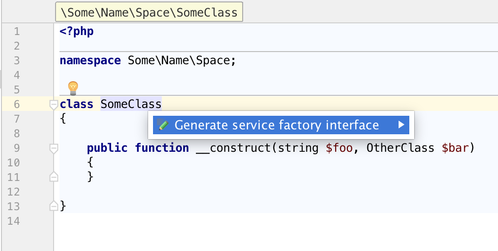
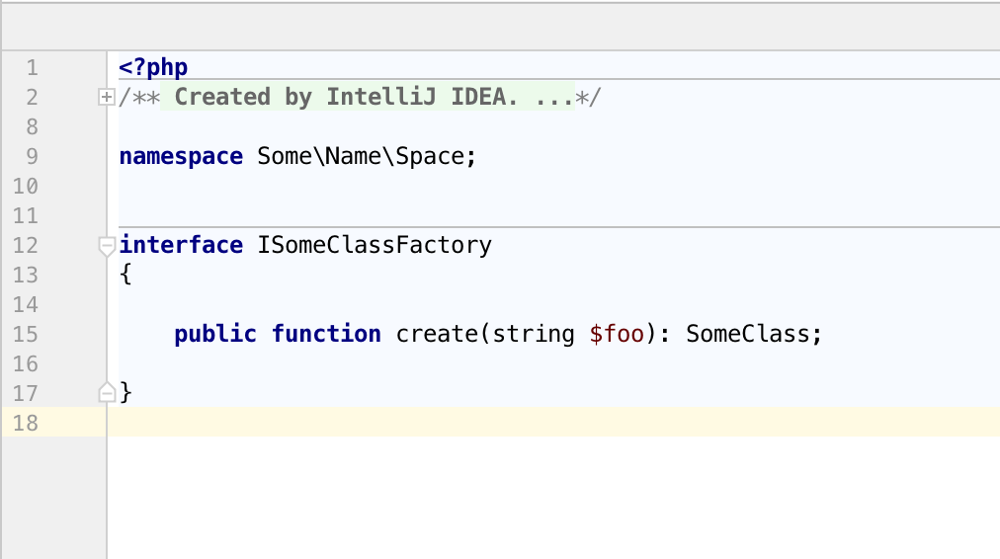

# Nette factory interface generator

This plugin allows you to quickly generate factory interface for your components and other classes.

## Installation and requirements

This plugin is written for PhpStorm 10 and above and is compiled for Java 8. You can find it in the Jetbrains plugin repository. Install it from Preferences → Plugins → Browse repositories... and search for it.

## Usage

With cursor anywhere in a PHP class, press <kbd>Alt</kbd> + <kbd>Enter</kbd> to open the intentions selection. Choose "Generate service factory interface".

A dialog will pop up allowing you to change the name of the factory interface and pick which constructor parameters should be enumerated in the factory's `create` method.

A new PHP file will then be created in the same directory, based on your `PHP File` file template. It will contain the factory interface, residing in the same namespace as the original class.

